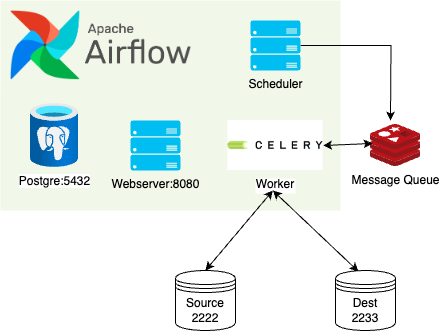
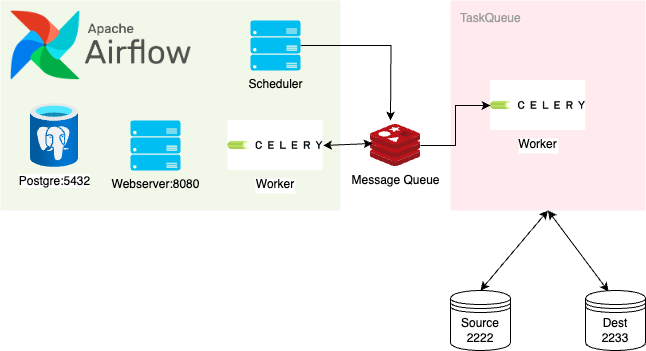

# airflow-sftp
## Requirement 
- docker
- poetry 

## Installation
Install poetry here: 

`
poetry env use 3.11
`

`
poetry install
`

This poetry is used for manage local dev enviroment.

## Start Server 
`./script/start-docker.sh`

Access airflow UI at [localhost:8008](http://localhost:8008/)

Access flower  UI at [localhost:5555](http://localhost:5555/)

Airflow Admin Username/Password: airflow/airflow

SSH Port of source: 2222
SSH Port of targer: 2233

Test for sftp server
`sftp -P 2222 airflow@localhost`
`sftp -P 2233 airflow@localhost`

## Assumption
- I did not consider the security of pipeline. 

## Approaches
## Functional Requirement 

### 1. Pure Airflow Operator

In file `dags/file_transfer_dag.py`
Operator FileTransferOperator in `plugins/file_transfer_plugin/operators/file_transfer_operator.py`

This is a basis Operator in Airflow to solving minimize problems transfer from source SFTP server to another SFTP server. 

This operator will flaws when we have large number of files + files that have larges. If this happen Airflow Executor will face I/O blocking task and on hold all queue task until this operator resolve.

### 2. Breakdown number of file and Another Operator for dedicated transfer task

This is an attempt to solving larges number of file problem
- In this project, I used Celery as TaskQueue (another celery server not Airflow) to showing how we could dedicated small transfer task for another TaskQueue like system. 
- In realitiy, we could apply this pattern for any kind of TaskQueue / or custom server API. 

`Note: I do not prefer to use dynamic dags because it will break the structure of DAG day by day. Therefore very hard to monitor. `

### 3. Breakdown file when large.
TODO: Code

This is an attempt to solving large file problem
- The large file will be divided into small one and processed like two difference files in pipeline. 
- E.g: file_1.txt = 1G. We will divide into 100MB chunks: 
file_1_.txt.divided.000001, ... , file_1_.txt.divided.000010
- Files will be transfer to target system ( the larger number of file are resolve with scaling task queue). 
- Another task will merge all divided file in target file system.

### 4. Changes in bussiness requirement.
In previous approach the pipeline has two cons:
1. The number of files increase overtime, thus the speed and memory used by pipeline is also increase. E.g: in first day: number of file in source is 3, the pipeline will scan all 3 file and compare with files target ( may be 0 ) . In the next day, the file increase to 6 -> we need to scan 6-3 files. Therefore, in the Tth day, the pipeline will process T*(avg_file_per_day). 
2. Pipeline is not idempotent: In every call, the output of pipeline is changed -> Hard to tracking bug and backfill data.

So to fix those cons, we could considering using date partition style in file structure:

- On March 1st, 2024:`sftp://<source>/a/b/c/file_1.txt` -> `sftp://<source>/a/b/c/2024/03/01/file_1.txt`
- On March 2nd, 2024, `sftp://<source>/a/b/c/file_1.txt` -> `sftp://<source>/a/b/c/2024/03/02/file_2.txt`
..etc.. 

Or if it is not possible, we can consider to clone data in `source/a/b/c` to `source/a/b/c/temp/2024/03/01/*.txt` by scaning date add in `source/a/b/c` . The old file within 30 days will be truncate and move to legacy path `source/a/b/c/old_data` for backfill purpose. 